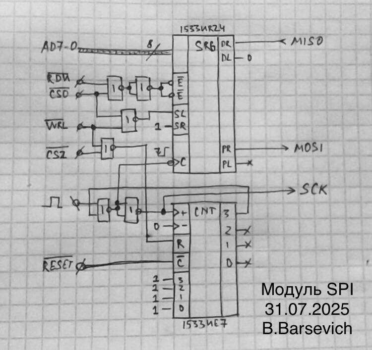

# SPI module for PDP-11-computers

## Types
Header: `spi_types.h`.
#### `spi_t`
- `bool sspi_enable` - use software SPI if not equal to 0;
- `hspi_t *hspi` - hspi descriptor;
- `sspi_t *sspi` - sspi descriptor.

## Methods

### High-level SPI interface (`spi.h`)
#### `spiex`
`(spi_t *spi, char din, char *dout)`

The function exchanges 1 byte of data via SPI. Returns: `int`. "`0`", if the transaction was successful, "`1`", if one of the pointers was broken.
#### `spisend_arr`
`(spi_t *spi, const char *din, size_t len)`

The function sends array of data via SPI. Returns: `int`. "`0`", if the transaction was successful, "`1`", if one of the pointers was broken.
#### `spireceive_arr`
`(spi_t *spi, char *dout, size_t len)`

The function receives array of data via SPI. Returns: `int`. "`0`", if the transaction was successful, "`1`", if one of the pointers was broken.
#### `spiex_arr`
`(spi_t *spi, const char *din, char *dout, size_t len)`

The function exchanges arrays of data via SPI. Returns: `int`. "`0`", if the transaction was successful, "`1`", if one of the pointers was broken.

### LL Software SPI (`sspi.h`)
#### `__sys_sspiex`
`(char *mosiport, char value)`

The function exchanges 1 byte of data via software SPI. Returns: `char`
#### `__sys_sspisend_arr`
`(char *mosiport, const char *src, size_t len)`

The function sends array of data via software SPI. Returns: `void`
#### `__sys_sspireceive_arr`
`(char *mosiport, char *dst, size_t len)`

The function receives array of data via software SPI. Returns: `void`
#### `__sys_sspiex_arr`
`(char *mosiport, const char *src, char *dst, size_t len)`

The function exchanges arrays of data via software SPI. Returns: `void`

### LL Hardware SPI (`hspi.h`)

#### `__sys_hspiex`
`(hspi_t *host, char value

The functions exchanges 1 byte of data via hardware SPI. Returns: `char`
#### `__sys_hspisend_arr`
`(hspi_t *host, const char *src, size_t len)`

The function sends array of data via hardware SPI. Returns: `void`
#### `__sys_hspireceive_arr`
`(hspi_t *host, char *dst, size_t len)`

The function receives array of data via hardware SPI. Returns: `void`
#### `__sys_hspiex_arr`
`(hspi_t *host, const char *src, char *dst, size_t len)`

The function exchanges arrays of data via hardware SPI. Returns: `void`

## Usage
Will be soon.

